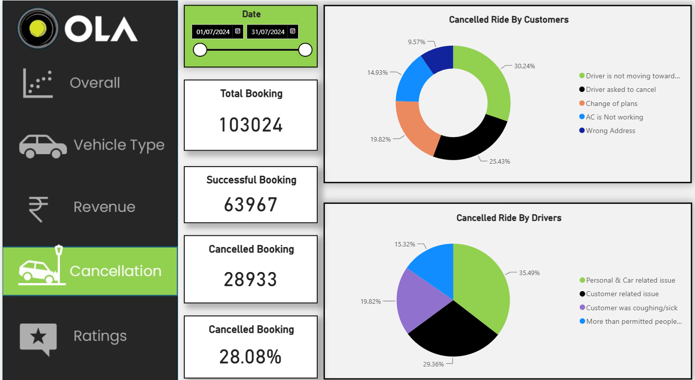
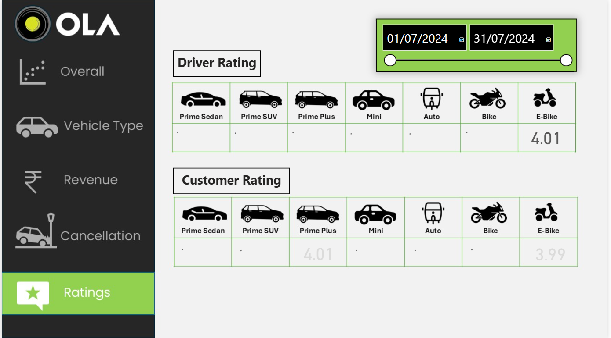
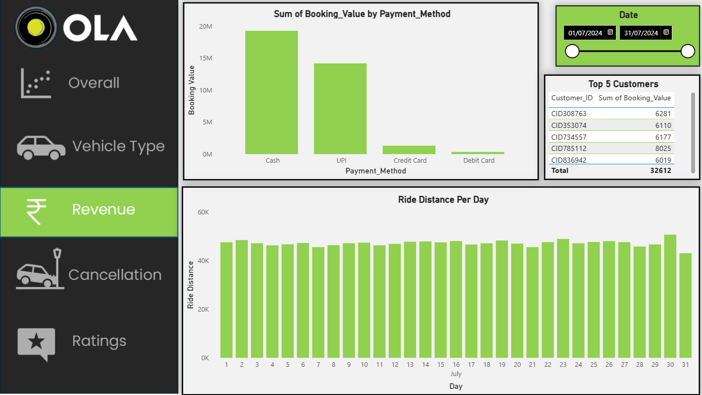

# Ola Bookings Data Analysis

## Project Overview

This project analyzes Ola booking data to understand booking performance, customer behavior, vehicle usage, cancellations, revenue, ride distance, and customer and driver ratings.

The project combines **MySQL for data analysis** and **Power BI for interactive data visualization and dashboard development**.

The analysis is designed to generate meaningful business insights from ride-booking data and demonstrate practical skills in SQL, data analysis, and business intelligence.

---

## Project Objectives

The main objectives of this project are to:

- Analyze overall booking performance.
- Identify patterns in successful and cancelled rides.
- Analyze vehicle-type performance.
- Understand customer booking behavior.
- Identify high-value customers.
- Analyze daily booking trends.
- Compare customer and driver ratings.
- Analyze revenue across payment methods.
- Understand cancellation patterns.
- Build an interactive Power BI dashboard.

---

## Dataset

The project uses an Ola booking dataset containing approximately 100,000 booking records.

The dataset includes information such as:

- Booking ID
- Booking status
- Customer ID
- Customer name
- Vehicle type
- Pickup location
- Booking value
- Booking date
- Ride distance
- Customer rating
- Driver rating
- Payment method
- Cancellation information

### Raw Dataset

The raw Excel dataset is available in:

`sql/OLA Booking Raw Data.xlsx`

---

# SQL Data Analysis

The SQL analysis was performed using **MySQL**.

The project contains 10 analytical questions covering booking performance, vehicle performance, customer behavior, time trends, cancellations, and ratings.

### SQL Questions

#### Q1. Overall Booking Performance

Calculate the overall:

- Booking success rate
- Cancellation rate
- Incomplete-ride rate

#### Q2. Vehicle Type with Highest Booking Value

Identify the vehicle type with:

- Highest total booking value
- Highest average booking value

#### Q3. Pickup Location Performance

Identify the pickup location with:

- Highest number of successful rides
- Average ride distance

#### Q4. Top 10 Customers by Booking Value

Identify the top 10 customers based on:

- Total booking value
- Number of successful rides

#### Q5. Daily Booking Trend

Analyze the daily booking trend in July and compare the number of bookings with the previous day.

#### Q6. 7-Day Rolling Average

Calculate the 7-day rolling average of successful bookings to understand the short-term booking trend.

#### Q7. Customer Cancellation Rate

Identify customers with multiple bookings and analyze their cancellation rates.

#### Q8. Customer vs. Driver Ratings

Compare the average customer rating and average driver rating for each vehicle type.

#### Q9. Top Vehicle Type by Pickup Location

Rank vehicle types by successful booking volume for each pickup location and identify the top-performing vehicle type.

#### Q10. Customer Preferred Vehicle Type

Identify each customer's most frequently used vehicle type and calculate the percentage of their successful bookings made using that vehicle type.

### SQL Concepts Used

- SELECT statements
- Aggregate functions
- GROUP BY
- HAVING
- ORDER BY
- Conditional aggregation
- Subqueries
- Common Table Expressions (CTEs)
- Window functions
- LAG()
- DENSE_RANK()
- PARTITION BY
- Views
- Percentage calculations

### SQL File

The complete SQL analysis is available here:

[View SQL Analysis](sql/ola_bookings_analysis.sql)

---

# Power BI Dashboard

An interactive Power BI report was developed to visualize the Ola booking data and present business insights through multiple analytical pages.

The Power BI report contains **five pages**, with each page focusing on a different aspect of the analysis.

## 1. Overall Analysis

The Overall page provides a high-level view of the key booking and ride-related metrics in the dataset.


---

## 2. Cancellation Analysis

The Cancellation page focuses on cancelled rides and provides insights into cancellation patterns and cancellation reasons.



---

## 3. Rating Analysis

The Rating page analyzes customer and driver ratings and provides a comparison of rating patterns across the dataset.



---

## 4. Revenue Analysis

The Revenue page analyzes booking value and revenue-related information, including revenue across different payment methods.



---

## 5. Vehicle Type Analysis

The Vehicle Type page analyzes vehicle-type performance, including ride distance and other vehicle-related metrics.


---

## Power BI File

The complete interactive Power BI report is available here:

[Download Power BI Report](sql/OLA%20Project.pbix)

---

# Project Structure

```text
Ola-Bookings-Data-Analysis/
│
├── README.md
│
├── sql/
│   ├── OLA Booking Raw Data.xlsx
│   ├── OLA Project.pbix
│   └── ola_bookings_analysis.sql
│
├── Overall.png
├── Cancellation.png
├── Rating.png
├── Revenue.png
└── Vehicle Type.png
---

# Skills Demonstrated

### Data Analysis

- Exploratory data analysis
- Business problem solving
- Customer analysis
- Vehicle performance analysis
- Revenue analysis
- Cancellation analysis
- Time-series analysis

### SQL

- MySQL
- Aggregations
- CTEs
- Subqueries
- Window functions
- Ranking
- Views
- Conditional calculations

### Power BI

- Data visualization
- Interactive dashboards
- KPI analysis
- Charts and graphs
- Business intelligence reporting
- Dashboard design

---

# Tools Used

| Tool | Purpose |
|---|---|
| **MySQL** | SQL-based data analysis |
| **Power BI** | Interactive dashboard and visualization |
| **Microsoft Excel** | Raw dataset |
| **GitHub** | Project hosting and documentation |

---

# Project Outcome

The project demonstrates an end-to-end data analytics workflow, starting from a raw booking dataset and progressing through SQL-based analysis to interactive Power BI visualization.

It showcases the use of **SQL and Power BI to transform raw operational data into meaningful business insights** related to customers, vehicles, bookings, cancellations, revenue, and ratings.
